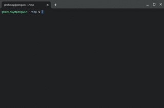

# RSS Podcast Extract

Have you ever wanted to download all the audio enclosures from a podcast rss feed? This is for you.

Here's a [video](https://threadit.app/thread/plpazglp38ddilsidl5g/message/s4m04bhb52yavk4t9d68n14g)

## FAQ

* How do I use this? Download the latest binaries from the [releases](https://github.com/ghchinoy/rss2mp3s/releases).
* Does it do a lot of checking? No.
* It doesn't work on a podcast URL. Not a question, but please [file a bug](https://github.com/ghchinoy/rss2mp3s/issues) with the podcast URL.
* Can it do other things? Maybe, [file a feature request](https://github.com/ghchinoy/rss2mp3s/issues).
* Is `ffmpeg` a pita? Yes.
* Does it automatically convert all enclosure audios to mp3? No, and don't @ me about the naming of this repo.
* Can you make that gif bigger? ref `ffmpeg` question, above.

## References

* Apple Podcasts https://podcasters.apple.com/support/823-podcast-requirements
* Google Podcasts https://support.google.com/podcast-publishers/answer/9889544?hl=en
